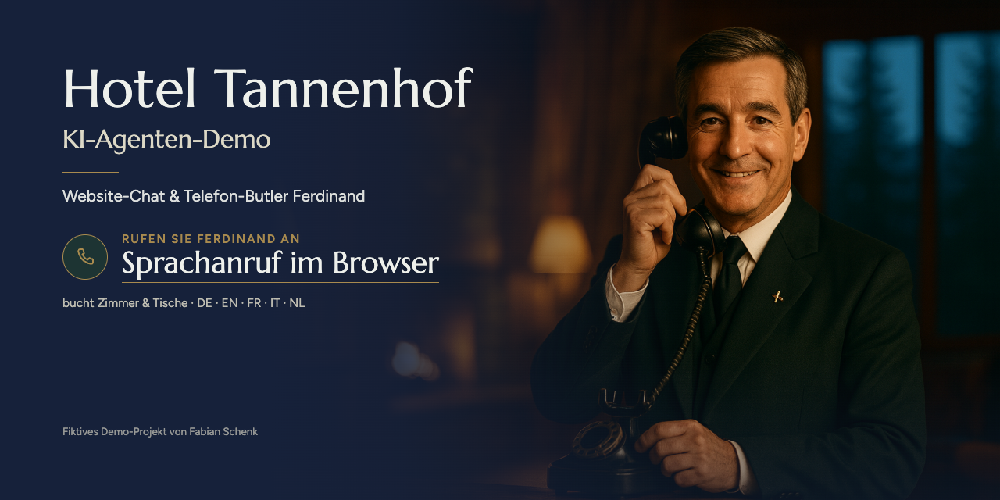
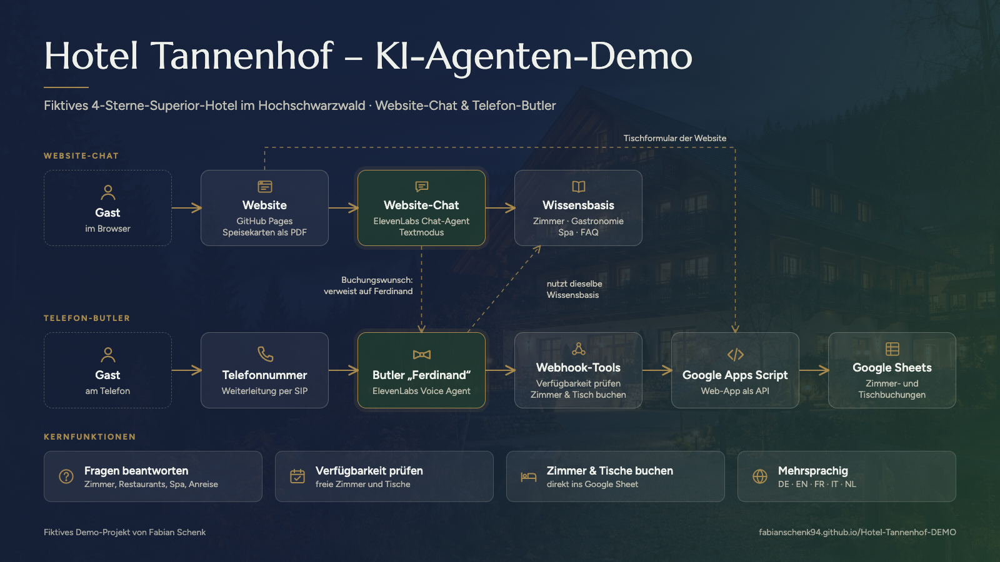

# Hotel Tannenhof Hinterzarten – KI-Agenten-Demo

**Live-Website:** https://fabianschenk94.github.io/Hotel-Tannenhof-DEMO/

> Fiktives Demo-Hotel. Kein reales Haus, keine echten Buchungen.

Ein vollständig erfundenes 4-Sterne-Superior-Hotel im Hochschwarzwald als Spielwiese für zwei KI-Agenten:

| Agent | Kanal | Aufgabe |
|---|---|---|
| **Website-Chat** | Chat-Widget auf der Website | Beantwortet Fragen zu Zimmern, Restaurants, Speisekarten, Spa und Anreise. Bucht nicht selbst, sondern verweist auf Ferdinand. |
| **Telefon-Butler „Ferdinand“** | Telefonnummer | Beantwortet Fragen, prüft freie Zimmer und Tische, bucht Zimmer und reserviert Tische – live im Google Sheet. |

Beide Agenten antworten standardmäßig auf Deutsch und wechseln bei Bedarf auf Englisch, Französisch, Italienisch oder Niederländisch.

## Architektur

- **Website-Chat:** ElevenLabs Chat-Agent im Textmodus. Greift nur auf die Wissensbasis zu, hat keine Tools. Bei Buchungswünschen verweist er auf Ferdinand.
- **Telefon-Butler:** ElevenLabs Voice Agent mit vier Webhook-Tools (Zimmer prüfen, Zimmer buchen, Tisch prüfen, Tisch reservieren). Nutzt dieselbe Wissensbasis wie der Chat, ergänzt um sprechgerecht aufbereitete Speisekarten und ein Aussprache-Wörterbuch.
- **Backend:** Google Apps Script als Web-App (API mit Token), Google Sheet als „Hotelsystem“ mit Zimmern, Belegung und Tischreservierungen.
- **Website:** statischer One-Pager (HTML, CSS, JavaScript) auf GitHub Pages. Das Tischformular schreibt direkt über Apps Script ins Sheet. Die Zimmer-Verfügbarkeit öffnet bewusst einen gesperrten Kalender und leitet zu Ferdinand weiter.
- **Bilder:** KI-generiert (OpenAI Images).

## So läuft eine Buchung am Telefon

1. Der Gast ruft an und nennt Anreise, Abreise und Personenzahl.
2. Ferdinand rechnet relative Angaben wie „nächstes Wochenende“ in Daten um und ruft `zimmer_verfuegbarkeit` auf.
3. Er nennt höchstens drei passende freie Kategorien mit Gesamtpreis.
4. Nach Namen und Telefonnummer fasst er alles zusammen und wartet auf ein klares Ja.
5. Erst dann ruft er `zimmer_buchen` auf. Die Buchung steht sofort als neue Zeile im Google Sheet, der Gast erhält eine Buchungsnummer (z. B. `TH-261009-AB12`).

Tischreservierungen laufen genauso, inklusive Ruhetagen und belegter Uhrzeiten.

## Inhalt

| Datei | Zweck |
|---|---|
| `index.html`, `img/` | Website und Bilder |
| `menus/` | Speisekarten Belvedere und Kaminstube als PDF (auf der Website verlinkt) |
| `docs/wissensbasis.md` | Wissensbasis für beide Agenten |
| `docs/speisekarten.md` | Speisekarten als Wissensdokument für den Website-Chat |
| `docs/Belvedere-Speisekarte-Butler.md`, `docs/Kaminstube-Speisekarte-Butler.md` | Speisekarten fürs Telefon: Kurzfassungen zum Vorlesen, Details auf Nachfrage |
| `docs/Tannenhof-Zimmer.pls`, `docs/Tannenhof-Aussprache-*.pls` | Aussprache-Wörterbücher (Hinterzarten, Suite, Schäufele …) |
| `docs/agent-telefon-butler.md` | System-Prompt, Tool-Definitionen und Testfälle des Telefon-Butlers |
| `docs/agent-website-chat.md` | System-Prompt und Testfragen des Website-Chats |
| `docs/Code.gs` | Apps-Script-Backend: Verfügbarkeit, Zimmerbuchung, Tischreservierung |
| `docs/ANLEITUNG.md` | Einrichtung Schritt für Schritt |
| `docs/bilder-prompts.json` | Prompts für die Bildgenerierung |

## Konzept und Umsetzung

Fabian Schenk – [LinkedIn](https://www.linkedin.com/in/fabianschenk-ai)
